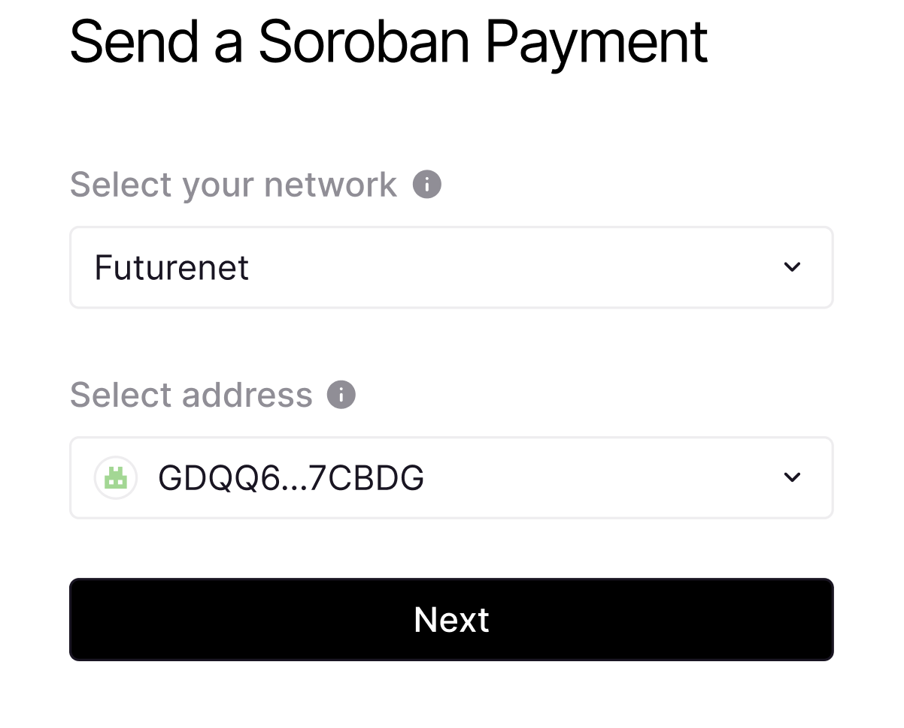
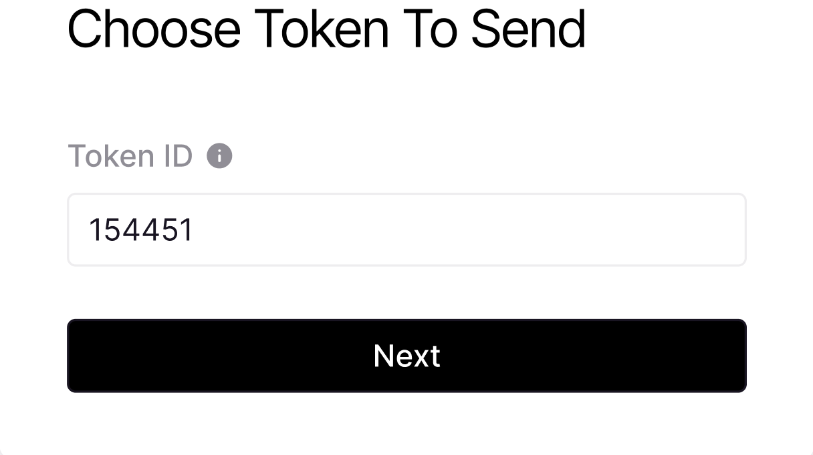
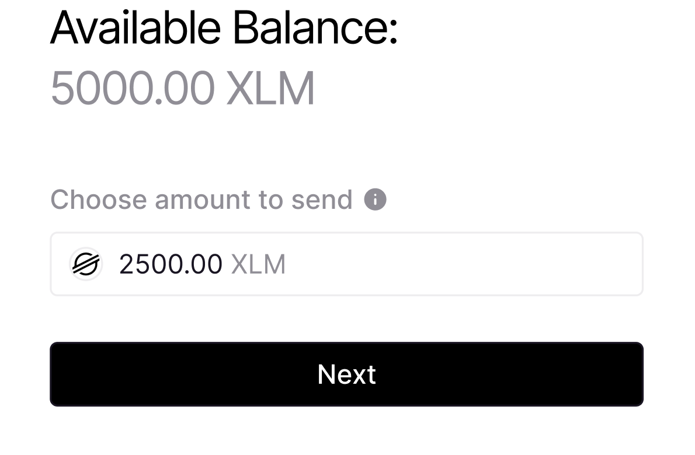
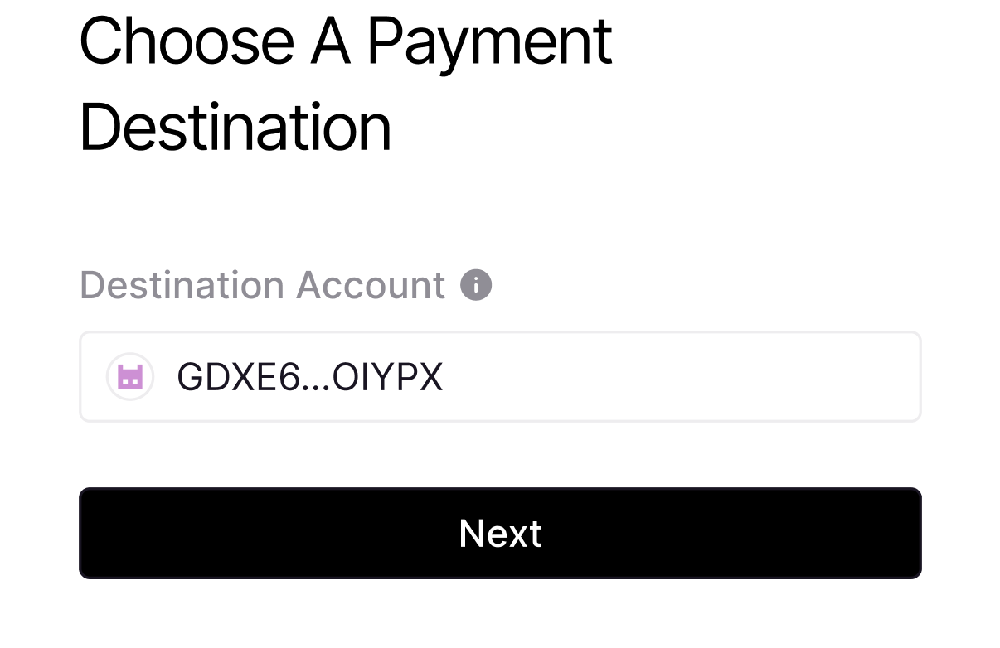
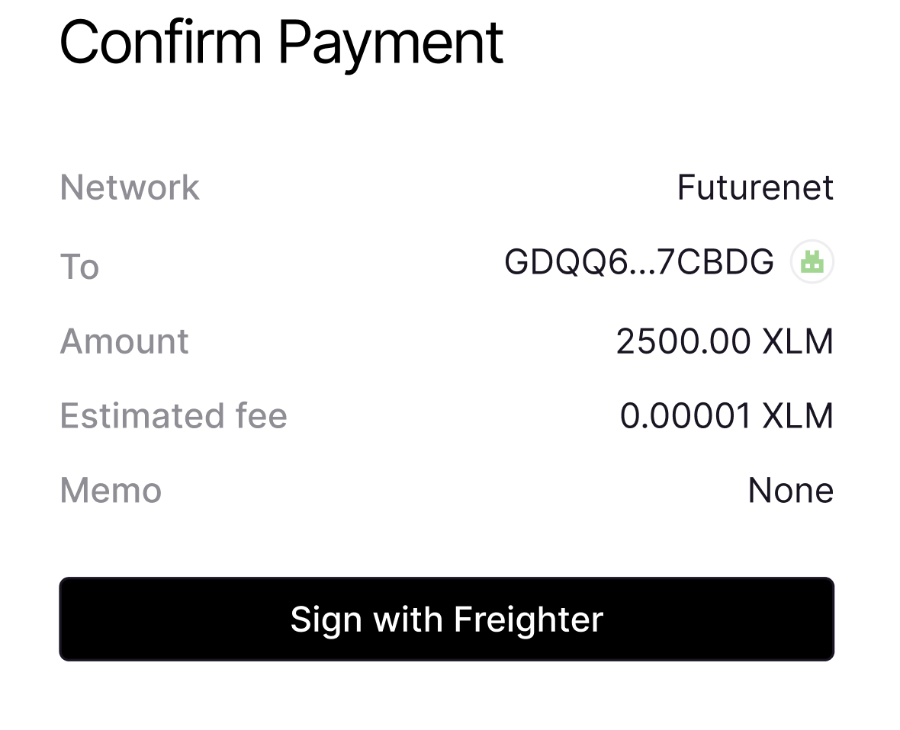
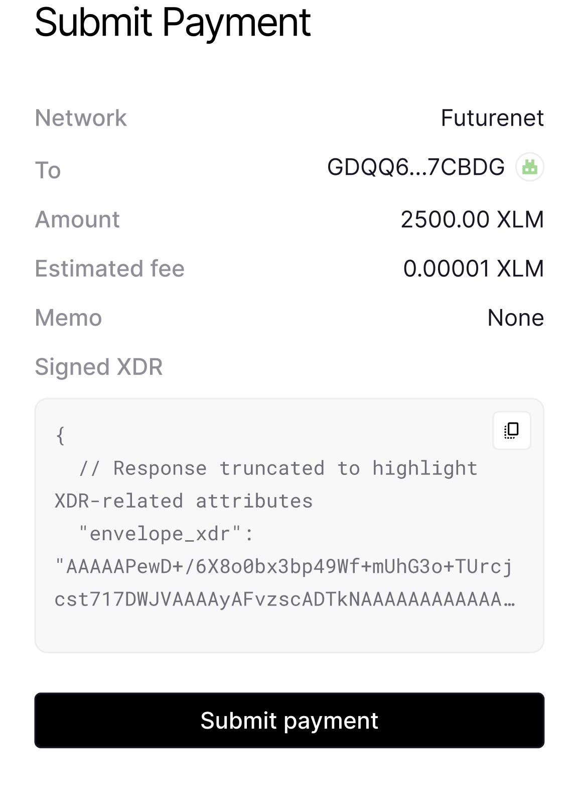

# Soroban React Payment

The Payment DApp is an easy to use application designed to mirror the Soroban payment flow currently found in Freighter. 

## Features 

The Payment DApp offers the following features:

1. **Wallet Connection**: Users can connect their Freighter wallet to the DApp, allowing seamless access to their Soroban token balances.

2. **Transaction Construction**: Leveraging the Soroban token's contract interface, the DApp constructs transactions that invoke the `xfer` method. This method facilitates the transfer of Soroban tokens from one address to another.

3. **Freighter Signing**: The DApp utilizes the signing capabilities of Freighter to obtain the necessary signatures for the transaction. This ensures the security and integrity of the transaction before it is submitted to the network.

## Getting Started

To use the Payment DApp, follow these steps:

1. Install and set up the [Freighter wallet](https://www.freighter.app/).

2. git clone the [Payment DApp repository]()

3. Connect your Freighter wallet to the DApp and ensure that experimental mode is enabled.


4. [Enable and add Soroban Tokens](https://soroban.stellar.org/docs/getting-started/connect-freighter-wallet#enable-soroban-tokens) in Freighter.

5. Select the account that will be used to send Soroban tokens.


6. Provide the required transaction parameters, such as the token to send,amount of tokens to transfer and the destination address.





7. Review the transaction details to ensure accuracy.

9. Click the "Sign with Freighter" . Freighter will prompt you to sign the transaction with your wallet's private key. 



10. Once signed, the click the "Submit payment" button and the transaction will be submitted to the network.



11. The DApp will show a confirmation message once the transaction has been successfully submitted.


## Prerequisites

The Payment DApp relies on the following dependencies:
- Node (>=16.14.0 <17.0.0): https://nodejs.org/en/download/

- Yarn (v1.22.5 or newer): https://classic.yarnpkg.com/en/docs/install

- Freighter wallet: The DApp requires the installation and setup of the Freighter wallet on the user's device. Make sure to follow the official documentation for installing and configuring Freighter.

## Build project

```
yarn && yarn build
```

## Starting a dev environment

```
yarn && yarn start
```

## Contributions

Contributions to the Payment DApp are welcome. If you encounter any issues, have suggestions for improvements, or would like to contribute to the codebase, please follow the guidelines outlined in the project's repository.

