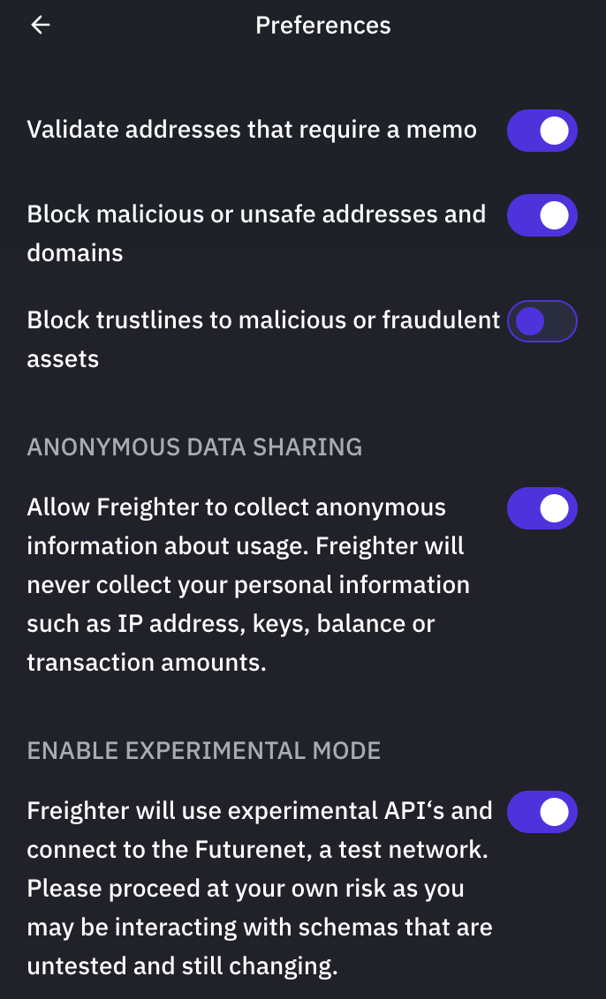
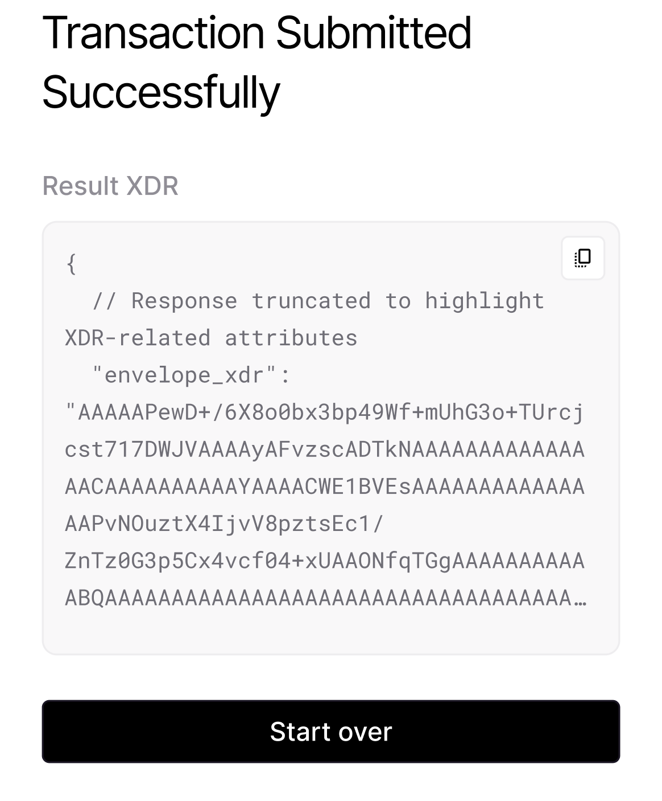

# Soroban React Payment

The Payment DApp is an easy to use application designed to mirror the Soroban
payment flow currently found in Freighter.

You can explore this dapp at https://scaffold-soroban.stellar.org/ by choosing
payment from the "select demo" dropdown.

## Prerequisites

The Payment DApp relies on the following dependencies:

- Node (>=16.14.0 <=18.0.0): https://nodejs.org/en/download/

- Yarn (v1.22.5 or newer): https://classic.yarnpkg.com/en/docs/install

- Freighter wallet(v5.0 or newer): https://www.freighter.app/

## Features

The Payment DApp offers the following features:

1. **Freighter Wallet Integration**: The Payment DApp seamlessly integrates with
   Freighter/Albedo/XBull, allowing users to connect their wallet to access
   Soroban token balances and utilize their signing capabilities for secure and
   integrity-checked transactions.

2. **Transaction Construction**: Leveraging the Soroban token's contract
   interface, the DApp constructs transactions that invoke the `transfer` method
   of the
   [token interface](https://github.com/stellar/soroban-examples/blob/main/token/src/contract.rs#L27).
   This method facilitates the transfer of Soroban tokens from one address to
   another.

## Getting Started

To use the Payment DApp, follow these steps:

1. Install and set up one of the supported wallets.

- [Freighter wallet](https://www.freighter.app/)
- [Albedo wallet](https://albedo.link/install-extension)
- [XBull wallet](https://xbull.app/)

2. Clone and navigate into the
   [Payment DApp repository](https://github.com/stellar/soroban-react-payment/tree/main)
   by running the following:

   ```
   git clone https://github.com/stellar/soroban-react-payment.git
   cd soroban-react-payment
   ```

3. Install the dependencies by running the following:

   ```
   yarn
   ```

4. If you are using the Freighter wallet, ensure that experimental mode is
   enabled. You can find this setting in Freighter wallet at:
   _`Settings(⚙️)>Preferences>ENABLE EXPERIMENTAL MODE`_.



6. [Enable and add Soroban Tokens](https://soroban.stellar.org/docs/getting-started/connect-freighter-wallet#enable-soroban-tokens)
   in Freighter.

7. Select the account that will be used to send Soroban tokens.


8. Provide the required transaction parameters, such as the token to send,amount
   of tokens to transfer and the destination address.


<br/>

<br/>


9. Review the transaction details to ensure accuracy and then click the "Sign
   with Freighter" once . Freighter will prompt you to sign the transaction with
   your wallet's private key.


10. Once signed, the click the "Submit payment" button and the transaction will
    be submitted to the network.


11. The Payment DApp will show a confirmation message once the transaction has
    been successfully submitted.



## Build the Project

```
yarn && yarn build
```

## Starting a Dev Environment

```
yarn && yarn start
```

## Contributions

Contributions to the Payment DApp are welcome. If you encounter any issues, have
suggestions for improvements, or would like to contribute to the codebase,
please submit an issue, pull request, or reach out to us on
[Discord](https://discord.com/channels/897514728459468821/1037073682599780494).
